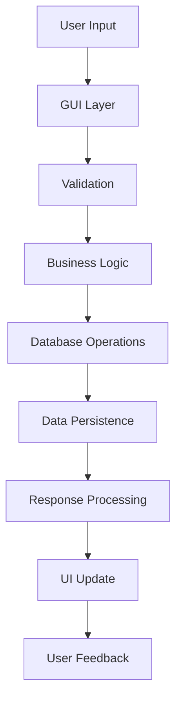

# 📇 Manajemen Kontak

<div align="center">


**Aplikasi manajemen kontak modern dengan GUI yang powerful dan fitur lengkap**

[Fitur](#-fitur-unggulan) • [Demo](#-demo) • [Instalasi](#-instalasi) • [Penggunaan](#-penggunaan) • [Dokumentasi](#-dokumentasi)

</div>

## 📋 Daftar Isi

- [Gambaran Umum](#-gambaran-umum)
- [Fitur Unggulan](#-fitur-unggulan)
- [Instalasi](#-instalasi)
- [ Penggunaan](#-penggunaan)
- [Contoh Data](#-contoh-data)
- [FAQ](#-faq)

## 🎯 Gambaran Umum

**Manajemen Kontak** adalah aplikasi manajemen kontak modern yang dibangun dengan Python dan Tkinter. Aplikasi ini menawarkan solusi lengkap untuk mengelola daftar kontak dengan interface yang user-friendly dan fitur-fitur canggih.

### 🎉 Highlights

- 🎨 **GUI Modern** dengan tema profesional dan responsive
- 💾 **Database SQLite** untuk penyimpanan yang aman dan terstruktur
- 📊 **Dashboard Statistik** real-time dengan visualisasi data
- 🔍 **Sistem Pencarian** canggih dengan filter multi-kriteria
- 📝 **History & Audit Trail** untuk melacak semua aktivitas
- 🏷️ **Manajemen Kategori** dengan warna kustom

## ✨ Fitur Unggulan

### 🤵 Core Features
- **Manajemen Kontak Lengkap** - Tambah, edit, hapus, dan lihat kontak
- **Multiple Kategori** - Organisasi kontak berdasarkan kategori
- **Quick Search** - Pencarian instan berdasarkan nama, telepon, atau email
- **Bulk Operations** - Operasi multiple kontak sekaligus

### 📊 Analytics & Reporting
- **Real-time Statistics** - Statistik kontak per kategori
- **Activity Dashboard** - Dashboard interaktif dengan grafik
- **History Tracking** - Log semua aktivitas pengguna
- **Export Reports** - Generate laporan dalam berbagai format

### 🔐 Data Management
- **SQLite Database** - Penyimpanan data yang robust
- **Auto-backup** - Backup otomatis database
- **Data Validation** - Validasi input data kontak
- **Import/Export** - Transfer data ke/dari format lain

### 🎨 User Experience
- **Modern GUI** - Interface yang intuitif dan menarik
- **Dark/Light Theme** - Dukungan multiple tema
- **Keyboard Shortcuts** - Navigasi cepat dengan keyboard
- **Responsive Design** - Adaptif untuk berbagai ukuran layar

### 🔧 Advanced Features
- **Duplicate Detection** - Deteksi kontak duplikat otomatis
- **Quick Actions** - Akses cepat ke fungsi umum
- **Data Backup** - Sistem backup dan restore
- **Multi-language** - Support multiple bahasa (coming soon)
 

## 🚀 Instalasi

### Prerequisites

- Python 3.7 atau lebih tinggi
- pip (Python package manager)
- SQLite3 (biasanya sudah included dengan Python)

### Step-by-Step Installation

1. **Clone atau Download Project**
   ```bash
   git clone https://github.com/username/manajemen-kontak-pro.git
   cd manajemen-kontak-pro
   ```

2. **Buat Virtual Environment (Recommended)**
   ```bash
   python -m venv kontak_env
   # Windows
   kontak_env\Scripts\activate
   # Linux/Mac
   source kontak_env/bin/activate
   ```

3. **Install Dependencies**
   ```bash
   pip install -r requirements.txt
   ```

4. **Jalankan Aplikasi**
   ```bash
   python main.py
   ```

### Quick Install (Windows)
```bash
# Download dan ekstrak project, kemudian:
python main.py
```

### Verifikasi Instalasi

Setelah instalasi, sistem akan:
- ✅ Membuat database SQLite otomatis
- ✅ Generate tabel-tabel required
- ✅ Insert data kategori default
- ✅ Siap digunakan!

## 💡 Penggunaan

### 🖥️ Menjalankan Aplikasi

```bash
python main.py
```

### 🎯 Basic Operations

1. **Menambah Kontak Baru**
   - Klik tab "Tambah Kontak"
   - Isi form: Nama, Telepon, Email, Kategori
   - Klik "Tambah Kontak"

2. **Melihat Daftar Kontak**
   - Navigasi ke tab "Daftar Kontak"
   - Gunakan search box untuk pencarian
   - Filter berdasarkan kategori

3. **Edit Kontak**
   - Double-click kontak di daftar
   - Edit data di form
   - Klik "Update Kontak"

4. **Hapus Kontak**
   - Pilih kontak dari daftar
   - Klik "Hapus Kontak"
   - Konfirmasi penghapusan

### 🔍 Advanced Features

**Pencarian Canggih:**
```
# Pencarian by nama
nama:John

# Pencarian by telepon
tel:08123456789

# Pencarian by kategori
kategori:Kantor

# Pencarian kombinasi
nama:John kategori:Keluarga
```

**Keyboard Shortcuts:**

| Shortcut | Action |
|----------|--------|
| `Ctrl + N` | Kontak Baru |
| `Ctrl + F` | Focus Search |
| `Ctrl + E` | Edit Kontak |
| `Ctrl + D` | Hapus Kontak |
| `Ctrl + S` | Simpan/Update |
| `Ctrl + Q` | Keluar |

### 📊 Dashboard & Reports

1. **View Statistics**
   - Buka tab "Dashboard"
   - Lihat statistik kontak per kategori
   - Monitor aktivitas terbaru

2. **Export Data**
   - Pilih kontak yang akan diexport
   - Klik "Export Selected"
   - Pilih format: CSV, JSON, atau TXT

## 🏗️ Arsitektur

### Data Flow



### Module Descriptions

| Module | Description |
|--------|-------------|
| `main.py` | Entry point aplikasi, initialize dan launch GUI |
| `manager.py` | Manajemen koneksi database dan operasi SQL |
| `kontak.py` | Business logic untuk operasi kontak |
| `window.py` | Implementasi GUI dengan Tkinter |
| `helpers.py` | Fungsi utility dan helpers |

## 📊 Contoh Data

### Sample Contact Data

```json
{
  "id": 1,
  "nama": "Budi Santoso",
  "telepon": "081234567890",
  "email": "budi.santoso@email.com",
  "kategori": "Keluarga",
  "tanggal_dibuat": "2023-12-01 10:30:00",
  "tanggal_diubah": "2023-12-01 10:35:30"
}
```

### Sample Category Data

```sql
INSERT INTO kategori (nama, warna) VALUES 
('Keluarga', '#e74c3c'),
('Teman', '#3498db'), 
('Kantor', '#2ecc71'),
('Darurat', '#f39c12'),
('Umum', '#95a5a6');
```

### Sample History Log

```json
{
  "id": 1,
  "aksi": "TAMBAH_KONTAK",
  "detail": "Kontak 'Budi Santoso' ditambahkan",
  "timestamp": "2023-12-01 10:30:15"
}
```

## ❓ FAQ

### Q: Apakah data kontak aman?
**A:** Ya! Data disimpan lokal di SQLite database dengan struktur yang aman.

### Q: Bisakah import data dari file Excel?
**A:** Fitur import Excel belum bisa. Saat ini support import CSV.

### Q: Apakah ada limit jumlah kontak?
**A:** Tidak ada limit praktis. SQLite bisa handle hingga 140TB data.

### Q: Bagaimana backup data?
**A:** Sistem auto-backup harian dan manual backup tersedia.

### Q: Support multiple user?
**A:** Saat ini single user.

### Troubleshooting

**Masalah Umum dan Solusi:**

1. **Database Error**
   ```
   Solution: Hapus file kontak.db dan restart aplikasi
   ```

2. **GUI Tidak Responsive**
   ```
   Solution: Check Python version (min 3.7) dan tkinter installation
   ```

3. **Import/Export Error**
   ```
   Solution: Pastikan file tidak sedang dibuka di aplikasi lain
   ```

---

<div align="center">

## ⭐ Support Project Ini ⭐

**Jika project ini membantu Anda, jangan lupa beri bintang di GitHub!**

[⬆ Kembali ke Atas](#-manajemen-kontak)

</div>