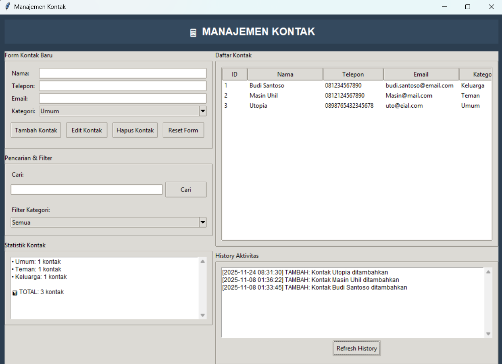
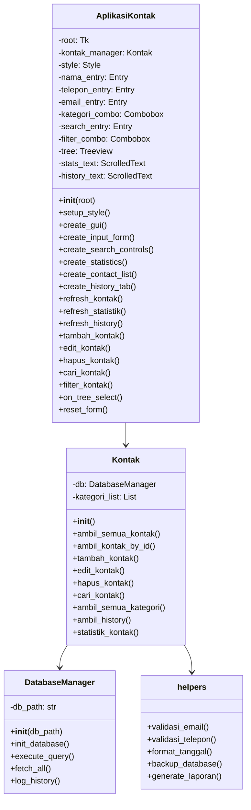
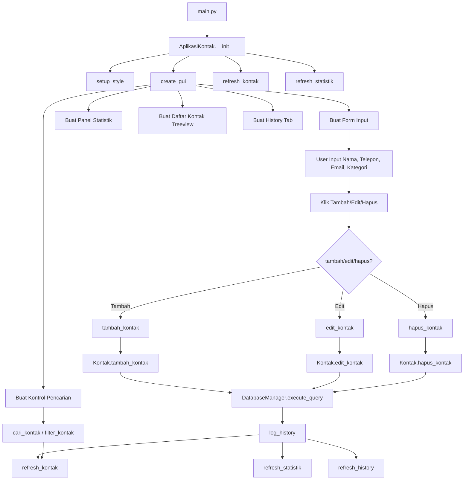
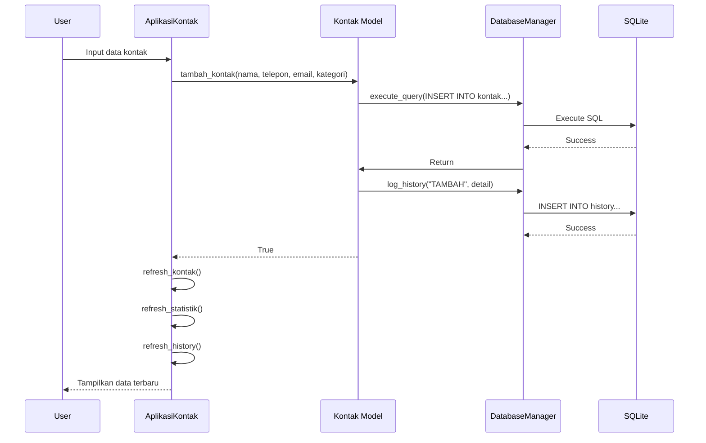

# 📱 Manajemen Kontak

<div align="center">


**Aplikasi manajemen kontak berbasis desktop dengan database SQLite**

</div>

## 📋 Deskripsi Proyek

**Manajemen Kontak** adalah aplikasi berbasis desktop yang dikembangkan sebagai bagian dari persyaratan untuk mendapatkan sertifikat dari Kelas.work by Kelas.com. Aplikasi ini dirancang untuk membantu pengguna mengelola kontak-kontak penting mereka dengan antarmuka yang modern, intuitif, dan kaya fitur.

Dibangun dengan Tkinter untuk antarmuka pengguna dan SQLite untuk penyimpanan data, aplikasi ini memungkinkan pengguna untuk:
- Menambah, mengedit, dan menghapus** kontak
- Mengelompokkan kontak** berdasarkan kategori
- Mencari kontak berdasarkan nama, telepon, atau email
- Memfilter kontak berdasarkan kategori
- Melihat statistik kontak per kategori
- Melacak history aktivitas pengguna

## 📑 Daftar Isi

- [Deskripsi Proyek](#-deskripsi-proyek)
- [Demo](#-demo)
- [Tampilan Aplikasi](#-tampilan-aplikasi)
- [Latar Belakang](#-latar-belakang)
- [Fitur Utama](#-fitur-utama)
- [Teknologi yang Digunakan](#-teknologi-yang-digunakan)
- [Arsitektur](#-arsitektur)
- [Struktur Proyek](#-struktur-proyek)
- [Cara Instalasi](#-cara-instalasi)
- [Cara Penggunaan](#-cara-penggunaan)
- [Peran Developer](#-peran-developer)
- [Pembelajaran dari Proyek](#-pembelajaran-dari-proyek-lessons-learned)
- [Ucapan Terima Kasih](#-ucapan-terima-kasih)

## 🎮 Demo

(Coming Soon)

## 📸 Tampilan Aplikasi

### Tampilan Utama




## 🎯 Latar Belakang

Proyek ini dibuat sebagai bagian dari perjalanan pembelajaran saya di Kelas.work by Kelas.com untuk memenuhi persyaratan sertifikat. Latar belakang pembuatan proyek ini meliputi:

- **Menerapkan konsep GUI programming** - Mempraktikkan Tkinter untuk membangun antarmuka pengguna yang modern
- **Mengimplementasikan database SQLite** - Menyimpan dan mengelola data kontak secara terstruktur
- **Membuat aplikasi yang berguna** - Menghasilkan alat manajemen kontak yang dapat digunakan sehari-hari
- **Menerapkan modular programming** - Memisahkan kode ke dalam modul-modul terpisah (database, GUI, models)

Kebutuhan yang melatarbelakangi proyek ini:
- **Banyak orang menyimpan kontak** di ponsel, namun sulit mengelola secara terstruktur di komputer
- **Kebutuhan akan aplikasi sederhana** yang dapat berjalan offline
- **Kebutuhan akan proyek portfolio** yang mendemonstrasikan keterampilan Python

## 🌟 Fitur Utama

### 📁 **Manajemen Kontak (CRUD Operations)**

| Fitur | Deskripsi | Implementasi |
|-------|-----------|--------------|
| **Tambah Kontak** | Menambahkan kontak baru dengan form lengkap | `tambah_kontak()` |
| **Edit Kontak** | Mengedit kontak yang sudah ada | `edit_kontak()` |
| **Hapus Kontak** | Menghapus kontak dengan konfirmasi | `hapus_kontak()` |
| **Reset Form** | Mengosongkan form input | `reset_form()` |
| **Validasi Input** | Memastikan nama tidak kosong | `if not nama: messagebox.showerror()` |

### 🏷️ **Kategori Kontak**

| Kategori | Warna Default | Deskripsi |
|----------|---------------|-----------|
| **Keluarga** | #3498db (Biru) | Anggota keluarga |
| **Teman** | #3498db (Biru) | Teman dan kenalan |
| **Kantor** | #3498db (Biru) | Rekan kerja |
| **Darurat** | #3498db (Biru) | Kontak darurat |
| **Umum** | #3498db (Biru) | Kontak umum lainnya |

### 🔍 **Pencarian dan Filter**

| Fitur | Deskripsi | Implementasi |
|-------|-----------|--------------|
| **Pencarian** | Mencari kontak berdasarkan nama, telepon, atau email | `cari_kontak()` dengan SQL LIKE |
| **Filter Kategori** | Menampilkan kontak per kategori | `filter_kontak()` |
| **Refresh Daftar** | Memuat ulang daftar kontak | `refresh_kontak()` |

### 📊 **Statistik Kontak**

| Fitur | Deskripsi | Implementasi |
|-------|-----------|--------------|
| **Jumlah per Kategori** | Menampilkan jumlah kontak setiap kategori | `statistik_kontak()` dengan GROUP BY |
| **Total Kontak** | Menampilkan total keseluruhan kontak | Sum dari semua kategori |
| **Update Otomatis** | Statistik update setelah setiap operasi | `refresh_statistik()` |

### 📜 **History Aktivitas**

| Fitur | Deskripsi | Implementasi |
|-------|-----------|--------------|
| **Log Aktivitas** | Mencatat setiap operasi (TAMBAH, EDIT, HAPUS) | `log_history()` |
| **Timestamp** | Mencatat waktu setiap aktivitas | `datetime.now()` |
| **Refresh History** | Memuat ulang history terbaru | `refresh_history()` |
| **Limit Data** | Menampilkan 50 history terbaru | `ORDER BY timestamp DESC LIMIT 50` |

### 🗄️ **Database SQLite**

| Tabel | Fungsi | Kolom |
|-------|--------|-------|
| **kontak** | Menyimpan data kontak | id, nama, telepon, email, kategori, tanggal_dibuat, tanggal_diubah |
| **history** | Menyimpan history aktivitas | id, aksi, detail, timestamp |
| **kategori** | Menyimpan daftar kategori | id, nama, warna |

### 🎨 **Antarmuka Pengguna**

| Fitur | Deskripsi |
|-------|-----------|
| **Treeview** | Menampilkan daftar kontak dalam tabel |
| **ScrolledText** | Menampilkan statistik dan history dengan scroll |
| **Combobox** | Dropdown untuk kategori dan filter |
| **Styling** | Tema modern dengan warna biru tua (#2c3e50) |
| **Double-click** | Memilih kontak dengan double-click untuk edit |

## 🛠️ Teknologi yang Digunakan

### Core Technologies

| Teknologi | Fungsi | Alasan Penggunaan |
|-----------|--------|-------------------|
| **Python 3.7+** | Bahasa pemrograman utama | Bahasa utama yang diajarkan di Kelas.work |
| **Tkinter** | GUI Framework | Library GUI bawaan Python, mudah dipelajari |
| **SQLite3** | Database | Database ringan tanpa server, cocok untuk aplikasi desktop |
| **ttk** | Themed Widgets | Widget modern dengan tema clam |

### Library yang Digunakan

| Library | Fungsi | Penggunaan |
|---------|--------|------------|
| **tkinter** | GUI components | `Tk`, `Frame`, `Label`, `Entry`, `Button` |
| **tkinter.ttk** | Themed widgets | `Notebook`, `LabelFrame`, `Treeview`, `Combobox` |
| **tkinter.scrolledtext** | Scrolled text widget | Menampilkan statistik dan history |
| **tkinter.font** | Font configuration | Mengatur font |
| **sqlite3** | Database | Menyimpan kontak, history, kategori |
| **datetime** | Timestamp handling | Mencatat waktu dibuat/diubah |
| **re** | Regular expressions | Validasi email dan telepon |

## 🏗️ Arsitektur

### Diagram Kelas



### Diagram Alur Aplikasi



### Diagram Alur Database



### Penjelasan File

| File | Fungsi untuk Kelas.work |
|------|--------------------------|
| **main.py** | Entry point aplikasi. Menampilkan banner dan menjalankan GUI. |
| **database/manager.py** | Berisi class `DatabaseManager` untuk koneksi dan operasi database SQLite. |
| **gui/window.py** | Berisi class `AplikasiKontak` untuk antarmuka pengguna dengan Tkinter. |
| **models/kontak.py** | Berisi class `Kontak` untuk logika bisnis dan operasi data kontak. |
| **utils/helpers.py** | Berisi fungsi helper: validasi email, telepon, format tanggal, backup, dll. |
| **kontak.db** | Database SQLite yang dibuat otomatis saat pertama kali menjalankan aplikasi. |

### Detail File

#### `database/manager.py`
```python
class DatabaseManager:
    - __init__(db_path)              # Inisialisasi koneksi database
    - init_database()                  # Membuat tabel jika belum ada
    - execute_query(query, params)     # Eksekusi query INSERT/UPDATE/DELETE
    - fetch_all(query, params)         # Eksekusi query SELECT
    - log_history(aksi, detail)        # Mencatat history aktivitas
```

#### `models/kontak.py`
```python
class Kontak:
    - __init__()                        # Inisialisasi database dan kategori
    - ambil_semua_kontak(kategori)      # Ambil semua kontak (bisa difilter)
    - ambil_kontak_by_id(id_kontak)     # Ambil kontak berdasarkan ID
    - tambah_kontak(nama, telepon, email, kategori)  # Tambah kontak
    - edit_kontak(id_kontak, nama, telepon, email, kategori)  # Edit kontak
    - hapus_kontak(id_kontak)           # Hapus kontak
    - cari_kontak(keyword)              # Cari kontak berdasarkan keyword
    - ambil_semua_kategori()            # Ambil semua kategori
    - ambil_history(limit)               # Ambil history aktivitas
    - statistik_kontak()                 # Ambil statistik per kategori
```

#### `gui/window.py`
```python
class AplikasiKontak:
    - __init__(root)                    # Inisialisasi aplikasi
    - setup_style()                      # Setup style Tkinter
    - create_gui()                        # Membuat antarmuka utama
    - create_input_form(parent)           # Membuat form input kontak
    - create_search_controls(parent)      # Membuat kontrol pencarian
    - create_statistics(parent)           # Membuat panel statistik
    - create_contact_list(parent)         # Membuat daftar kontak treeview
    - create_history_tab(parent)          # Membuat tab history
    - refresh_kontak(kontak_list)         # Refresh daftar kontak
    - refresh_statistik()                  # Refresh statistik
    - refresh_history()                     # Refresh history
    - tambah_kontak()                       # Handler tambah kontak
    - edit_kontak()                          # Handler edit kontak
    - hapus_kontak()                          # Handler hapus kontak
    - cari_kontak()                            # Handler pencarian
    - filter_kontak(event)                     # Handler filter kategori
    - on_tree_select(event)                     # Handler double-click treeview
    - reset_form()                                # Reset form input
```

#### `utils/helpers.py`
```python
- validasi_email(email)                # Validasi format email dengan regex
- validasi_telepon(telepon)             # Validasi format telepon dengan regex
- format_tanggal(timestamp)              # Format timestamp ke format Indonesia
- backup_database()                       # Backup database (placeholder)
- generate_laporan()                       # Generate laporan (placeholder)
```

## 📥 Cara Instalasi

### Prasyarat (Kelas.work Environment)

- **Python 3.7 atau lebih tinggi** - [Download Python](https://www.python.org/downloads/)
- **Tkinter**

### Langkah-langkah Instalasi

1. **Clone Repository**
   ```bash
   git clone https://github.com/Chrisimana/manajemen-kontak.git
   cd manajemen-kontak
   ```

2. **Buat Virtual Environment (Opsional)**
   ```bash
   # Windows
   python -m venv venv
   venv\Scripts\activate
   
   # Linux/Mac
   python3 -m venv venv
   source venv/bin/activate
   ```

3. **Jalankan Aplikasi**
   ```bash
   python src/main.py
   ```

### Verifikasi Tkinter

Untuk memastikan Tkinter terinstal dengan benar:
```bash
python -c "import tkinter; tkinter._test()"
```

Jika muncul jendela dialog, maka Tkinter sudah terinstal dengan baik.

### Database

Database `kontak.db` akan dibuat secara otomatis saat pertama kali menjalankan aplikasi, dengan struktur tabel:
- **kontak** - Menyimpan data kontak
- **history** - Menyimpan history aktivitas
- **kategori** - Menyimpan daftar kategori (default: Keluarga, Teman, Kantor, Darurat, Umum)

## 🎮 Cara Penggunaan

### Menjalankan Aplikasi

```bash
python src/main.py
```

### Panduan Penggunaan Lengkap

#### 1. **Menambah Kontak Baru**

**Langkah-langkah:**
1. Isi field **Nama** (wajib diisi)
2. Isi **Telepon** (opsional)
3. Isi **Email** (opsional)
4. Pilih **Kategori** dari dropdown
5. Klik tombol **"Tambah Kontak"**

**Contoh Input:**
- Nama: `Budi Santoso`
- Telepon: `081234567890`
- Email: `budi@mail.com`
- Kategori: `Teman`

#### 2. **Mengedit Kontak**

**Langkah-langkah:**
1. **Double-click** pada kontak yang akan diedit di daftar kontak
2. Data kontak akan muncul di form input
3. Ubah data yang diperlukan
4. Klik tombol **"Edit Kontak"**

#### 3. **Menghapus Kontak**

**Langkah-langkah:**
1. Pilih kontak yang akan dihapus (klik sekali)
2. Klik tombol **"Hapus Kontak"**
3. Konfirmasi dengan dialog "Ya/Tidak"
4. Kontak akan dihapus permanen

#### 4. **Mencari Kontak**

**Langkah-langkah:**
1. Masukkan keyword pencarian di field **"Cari"**
2. Klik tombol **"Cari"**
3. Hasil pencarian akan ditampilkan di treeview
4. Untuk kembali ke semua kontak, kosongkan field dan klik "Cari"

**Keyword bisa berupa:**
- Nama (contoh: "Budi")
- Telepon (contoh: "0812")
- Email (contoh: "@mail.com")

#### 5. **Memfilter Kontak per Kategori**

**Langkah-langkah:**
1. Pilih kategori dari dropdown **"Filter Kategori"**
2. Daftar kontak akan difilter sesuai kategori yang dipilih
3. Pilih "Semua" untuk menampilkan semua kontak

#### 6. **Melihat Statistik Kontak**

Panel statistik di sebelah kiri menampilkan:
- Jumlah kontak per kategori
- Total keseluruhan kontak
- Update otomatis setiap ada perubahan

#### 7. **Melihat History Aktivitas**

1. Scroll di area history untuk melihat aktivitas
2. Klik tombol **"Refresh History"** untuk memuat ulang
3. History menampilkan: timestamp, aksi (TAMBAH/EDIT/HAPUS), dan detail

#### 8. **Reset Form**

Klik tombol **"Reset Form"** untuk mengosongkan semua field input.

### Format Input yang Valid

| Field | Format | Contoh | Keterangan |
|-------|--------|--------|------------|
| **Nama** | Text | "Budi Santoso" | Wajib diisi |
| **Telepon** | Angka minimal 10 digit | "081234567890" | Opsional |
| **Email** | Format email | "budi@mail.com" | Opsional |
| **Kategori** | Pilihan | Teman | Dropdown selection |

### Shortcut dan Tips

| Aksi | Cara |
|------|------|
| **Edit kontak** | Double-click pada kontak di treeview |
| **Hapus kontak** | Pilih kontak, klik "Hapus" |
| **Reset pencarian** | Kosongkan field pencarian, klik "Cari" |
| **Refresh history** | Klik "Refresh History" |

## 👨‍💻 Peran Developer

### Peran dalam Proyek

| Area | Kontribusi |
|------|------------|
| **Perencanaan** | Merancang fitur-fitur aplikasi manajemen kontak |
| **Database Design** | Mendesain struktur tabel SQLite (kontak, history, kategori) |
| **Backend Development** | Implementasi class `DatabaseManager` dan `Kontak` |
| **GUI Development** | Membangun antarmuka dengan Tkinter dan ttk |
| **Styling** | Mendesain tema dengan warna biru tua (#2c3e50) |
| **Data Management** | Operasi CRUD dengan SQLite |
| **Search & Filter** | Implementasi pencarian dengan SQL LIKE |
| **History Tracking** | Mencatat setiap aktivitas ke database |
| **Validation** | Validasi input menggunakan regex |
| **Error Handling** | Penanganan exception dengan messagebox |

### Fokus Pengembangan

1. **Fungsionalitas Inti**
   - CRUD operations untuk kontak
   - Pencarian dan filter yang responsif
   - Kategorisasi kontak

2. **User Experience**
   - Antarmuka modern dengan tema gelap
   - Double-click untuk edit
   - Konfirmasi untuk operasi penting
   - Feedback visual dengan messagebox

3. **Data Integrity**
   - Database dengan foreign key (implisit)
   - History tracking untuk audit
   - Validasi input

4. **Modular Design**
   - Pemisahan kode ke dalam package (database, gui, models, utils)
   - Class dengan tanggung jawab spesifik
   - Fungsi helper untuk utilitas umum

## 📚 Pembelajaran dari Proyek (Lessons Learned)

### Keterampilan Teknis yang Diperoleh

1. Database Design dengan SQLite
2. Tkinter Treeview untuk Tampilan Tabel
3. Styling dengan ttk
4. Pencarian dengan SQL LIKE
5. History Tracking
6. Validasi dengan Regex
7. Dynamic UI Updates


### Soft Skills yang Dikembangkan

#### 1. **Problem Decomposition**
- Memecah aplikasi menjadi komponen-komponen
- Memisahkan tanggung jawab ke dalam class berbeda
- Mendesain UI dengan panel-panel terpisah

#### 2. **User-Centered Design**
- Memikirkan pengguna akhir dalam setiap fitur
- Double-click untuk akses cepat ke edit
- Feedback visual dengan messagebox

#### 3. **Code Organization**
- Struktur folder yang rapi
- Naming convention yang konsisten
- Pemisahan konfigurasi dan logika

#### 4. **Testing and Debugging**
- Menguji dengan berbagai skenario input
- Menangani edge cases
- Menggunakan try-except untuk error handling

## 🙏 Ucapan Terima Kasih

### Kelas.work by Kelas.com
Terima kasih yang sebesar-besarnya kepada Kelas.work by Kelas.com atas:
- **Kurikulum** yang memungkinkan peserta belajar pengembangan aplikasi desktop
- **Mentor dan instruktur** yang membimbing selama pembelajaran
- **Sertifikat** yang memotivasi untuk terus belajar

### Sumber Daya dan Referensi

#### Dokumentasi Resmi
- [Python Documentation](https://docs.python.org/3/) - Bahasa pemrograman
- [Tkinter Documentation](https://docs.python.org/3/library/tkinter.html) - GUI framework
- [SQLite Documentation](https://www.sqlite.org/docs.html) - Database
- [Regular Expression Documentation](https://docs.python.org/3/library/re.html) - Validasi

#### Tools yang Membantu
- **GitHub** - Hosting repository dan version control
- **Visual Studio Code** - Editor kode
- **DB Browser for SQLite** - Melihat dan mengedit database
- **Shields.io** - Badges untuk README
- **Mermaid.js** - Diagram alur

---

<div align="center">

**⭐ Jika proyek ini membantu perjalanan belajar Anda di Kelas.work, berikan bintang! ⭐**

**"Menyimpan kontak itu mudah, mengelolanya dengan baik itu seni"**

</div>